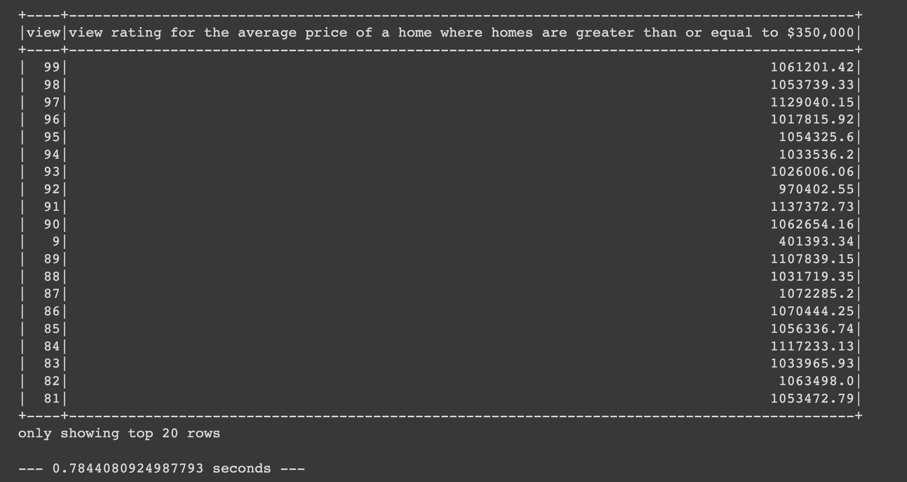
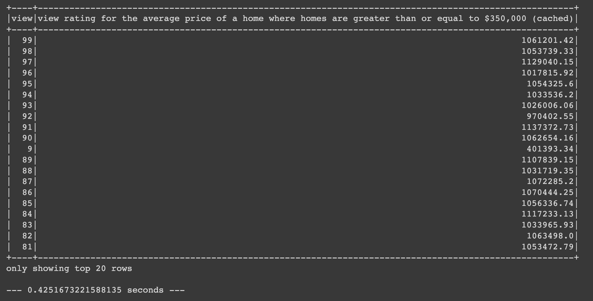
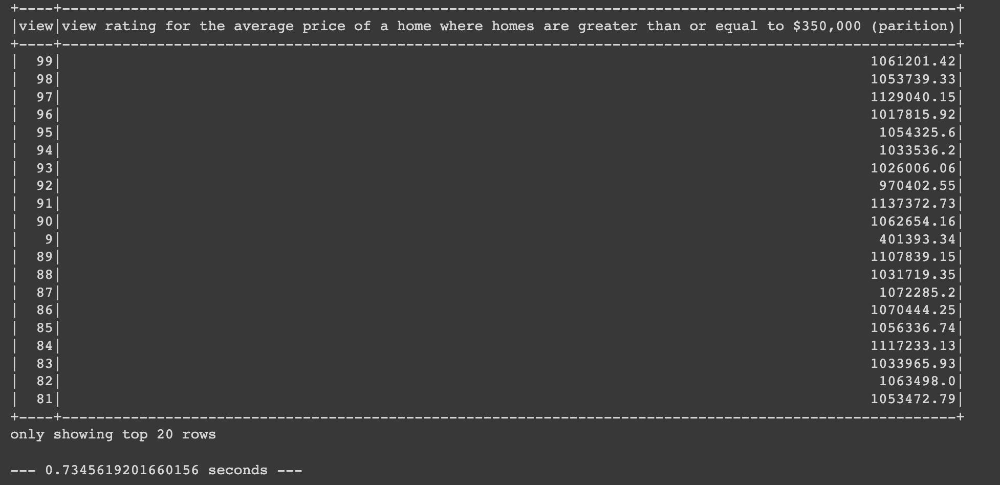

# Home-Sales-Pyspark

**About:** This challenge uses SparkSQL to determine key metrics about home sales data. Pyspark is then used to create temporary views, partition the data, cache and uncache a temporary table, and verify that the table has been uncached.

**Comparing the runtime of uncached, cached and partitioned data**
-
**Uncached:**

**Cached:**

**Partitioned:**

As we can see, the cached data outperformed the uncached and partitioned data in terms of runtime. Caching is the optimal technique for improving performance of this dataset because the data is being used for subsequent queries and it is small enough to fit in memory.